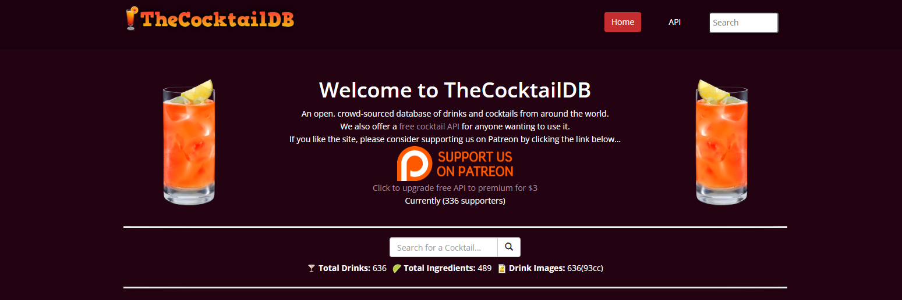

# cocktailsDb
Backend Dev exam project 2024

In this readme guide I will write what I did in every guthub push so it is easily trackable after.

## Project structure 

I'll be using the free accessible cocktaildb that stores different type of drinks in their database. It's flexible, offers enough data and it is very easy applyable in data structures. (link:https://www.thecocktaildb.com/)

This project will include :
    - Dotnet web application ✔
    - EF Database using MySql (with data seeding) ✔
    - Different kind of HTTP endpoints ✔
    - REST Client files (http.rest)
    - Swagger Documentation
    - FluentValidation
    - Automapper
    - Route Groups
    - API Keys for security
    - Versioning
    - Caching
    - Background Services
    - Testing
        + Unit 
        + Integration 
        + K6
    - Blazor UI
    - Extensions
        + GraphQl
        + Extra fancy stuff
    

## Initial push
- Created a new dotnet web application + EF prep

## 1 -  EF preperation
 - Created project structure (context)
 - added newtonsoft for correct data binding

## 2 - Route Creation
- Created Repository & Services
- Created HTTP Endpoints plus testing
- added fluent validation